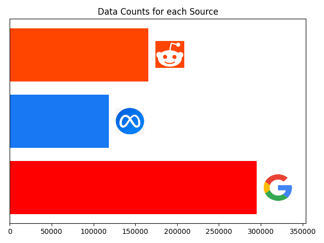
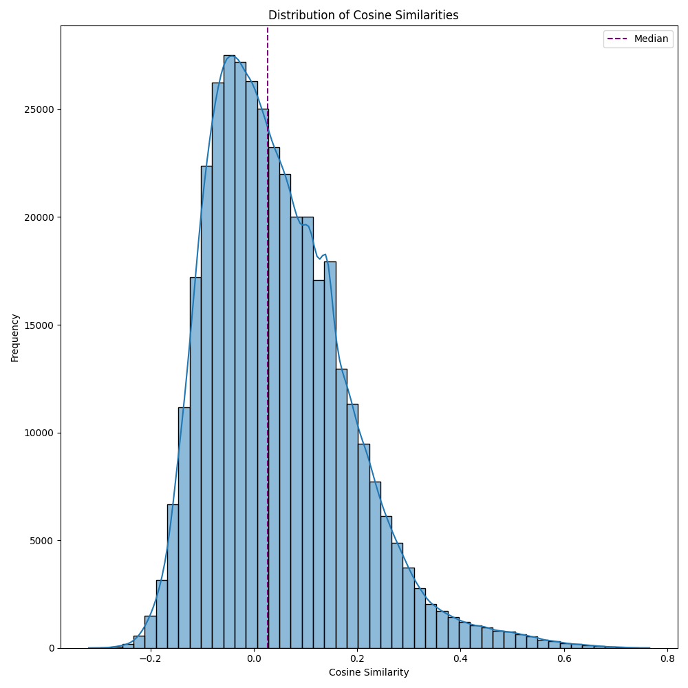
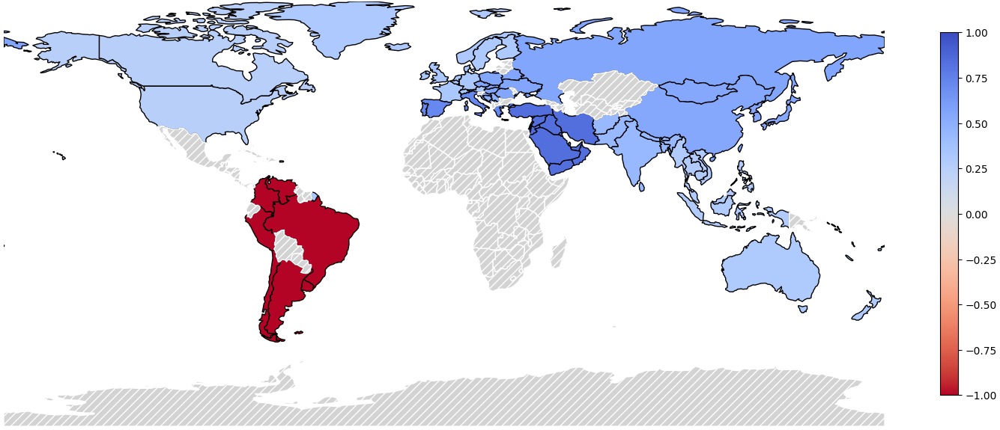
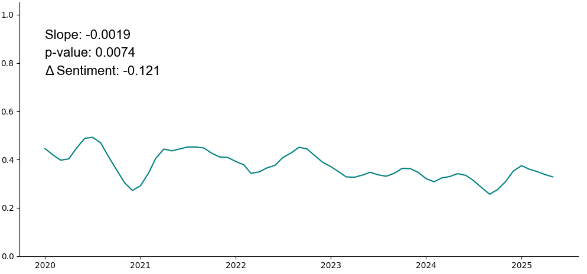

# Social Listening Project
------------------------------------------------------------------------

## Table of Contents
- [Project Organization](#project-organization)
- [Project Introduction](#project-introduction)
- [Project Workflow](#project-workflow)

**As a note, I will not explain the overall theme of the project
or the specific results because this was completed for a client.
As such, only the flow of the project and the methods used
are discussed. I made every effort to mask theme specific queries,
keywords, and results.**

This project uses social listening methods, including publicly
available APIs (Google and Reddit APIs) and playwright to automate
web scraping of social media platforms to better understand
customer sentiment towards the broader topic of business models
for extended services for electronic devices.

To complete this project, I build an end-to-end data ingestion
pipeline, including sentiment analysis and theme discovering.
I further build a RAG model to extract key insights, i.e. pain points
and drivers, to provide the client with actionable insights.

## Project Organization
    root
    ├── data # not uploaded for coherence with DSGVO and GDPR regulations
    │   ├── processed # processed data files
    │   ├── RAG # contains output files from RAG queries and FAISS archives    
    │   └── raw # the raw extracted social media content
    ├── images # images used to evaluate and visualize results, some anonymized images are presented
    ├── src
    │   ├── data # code for data ingestion
    │   │    ├── browser_scraping_functions.py # functions used by playwright
    │   │    ├── reddit_scraper.py # script for scraping Reddit
    │   │    ├── shared_functions.py # functions used in multiple scraping scripts
    │   │    ├── threads_get_login.py # script to save auth_state for Threads
    │   │    ├── threads_retrieve_ids.py # script used to retrieve post ids from Threads searches
    │   │    ├── threads_scraper.py # script used to scrape Threads posts
    │   │    └── youtube_scraper.py # script used to scrape YouTube
    │   ├── formatting
    │   │    ├── data_formatting_pipeline.py # functions used for data formatting
    │   │    ├── format_data.py # formatting data, creating embeddings, and filtering data
    │   │    └── shared_functions.py # general functions for data formatting
    │   ├── models
    │   │    ├── scoring_functions.py # finds frequencies of similar comments and generates scores
    │   │    ├── sentiment_analysis.py # analyzes sentiment and finds themes
    │   │    ├── sentiment_visualization.py # visualizes sentiment
    │   │    └── shared_functions.py # general functions used by scripts
    │   └── RAG
    │        ├── build_archive.py # builds the FAISS archive
    │        ├── rag_functions.py # functions used by the RAG model
    │        ├── run_rag.py # builds prompts and queries the database
    │        └── shared_functions.py # general functions for data formatting
    ├── .env # stores API keys and other private information, not uploaded
    ├── .gitignore
    ├── LICENSE
    ├── README.md
    └── requirements.txt

## Project Introduction

The goal of this project is to develop actionable insights from customer sentiment
about device protection and extended services.

Data were collected from three sources, Reddit, Threads, and YouTube. In the case
of Reddit and YouTube, they both have fairly reasonable APIs that can be used for
large scale data collection. Threads, on the other hand, offers no usable API that
permits users to access the search function and scrape relevant posts. Therefore,
I created a Threads scraper that utilizes playwright to scrape post ids and scrape
post and reply content. Because Threads generally discourages bot use, I developed
a scraper that mimics human behaviour by inserting random pauses, hovering over
random links, and opening random user profiles and images. The Threads scraper
functions with good success and can generally run for hours without interruption.

## Project Workflow

I first collected data from my sources and then proceeded to clean text to make it
suitable for text embeddings. This followed a variety of best practices, including
removing punctuation and html tags, lemmatizing and standardizing text, lower casing,
removing stop words, and other processes. Additionally, because this was a global
scale project, it was necessary to identify comment languages to use appropriate stop
word removal and lemmatization. I collected data from over 50 languages. The plot below presents a bar plot of the number of comments collected from each source.

  

After formatting the data, I filtered the dataset to reduce the number of irrelevant comments
and ensure the quality of the collected data. To this end, I wrote a series of sentences
describing the relevant topics and used a multilingual text embedder to vectorize the
text. Those embeddings were compared against text embeddings using cosine similarity. Comments
below a threshold of 0.5 for all of the described topics were discarded. Below is an example
image of the distribution of cosine similarities for one topic.

  

After data filtering, I performed sentiment analysis with a BERT-multilingual
model. Scores were normalized between -1 (most negative) to 1 (most positive)
for ease of interpretation, and BERTopic was used to cluster similar comments
and identify themes. Prior to scoring, I used DBSCAN to cluster similar comments
together to achieve a frequency of comment metric and summed the likes across
all similar comments. Then a score was assigned using the following equation:

  <strong>log(likes) + α · log(frequency)</strong>

I used logarithmic scale to reduce the impact of viral posts. α represents
a scaler that can be used to weight either likes or comment frequency more
heavily, although I used a scalar of one to provide equal weighting to likes
and frequency.

I then visualized the sentiment based on region as well as the sentiment across
themes over the whole world. The image below presents the sentiment plot on a
regional basis. This shows the sentiment for Topic 1 in each region where
data was collected. Dark blue represents very positive sentiment and dark red
represents very negative sentiment.

  

I was also interested to know how sentiment has changed over time. So, I performed
a timeseries analysis and used the Mann-Kendall test to determine if there was
a trend in the data. I used the Mann-Kendall test because fluctuations in
sentiment overtime were generally not conducive to using standard regression
techniques. I extracted the slope and p-value for presentation and used the slope
to determine how much sentiment had changed over the previous 5 years. The slope
represents the monthly change and the change in sentiment represents the 5 year
difference.

  

The final step of the project was to build a RAG model to determine pain points and
drivers to produce actionable insights. I used `langchain` in conjunction with `FAISS` and the OpenAI API. In order to give the model more context per refine, 100 comments were connected and given to the model with the prompt. For refinement context, the previous answer and a new refine prompt was given. Temperature was set to 0.2 in order to limit AI hallucinations. Additionally, I cataloged each comment, the original index from the dataset, and other meta data, along with the answer and the question so that the sensibility of the answer could be verified. I then averaged scores across comments used in the development of each pain point and driver to rank relative importance.
